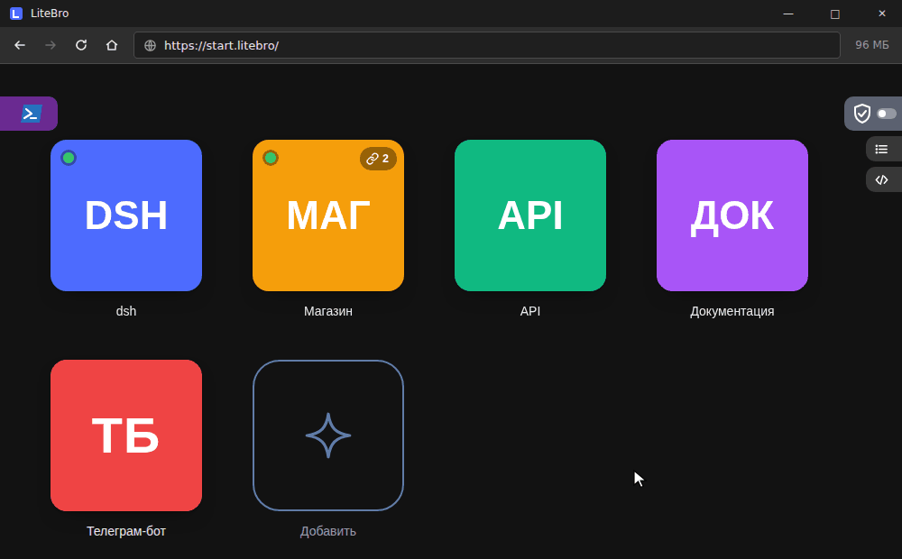

# LiteBro



Лёгкий браузер для локальных проектов под Windows. Внутри — движок Edge WebView2, который уже есть в Windows. LiteBro занимает меньше памяти и процессора, чем Chrome: ресурсы остаются программам, например языковой модели на CPU.

LiteBro создан для локальных адресов: `localhost`, `*.localhost`, имена из `hosts` и частные сети. Интернет в нём тоже работает, а одна кнопка на стартовой странице закрывает выход в сеть: остаются этот компьютер, локальная сеть и сайты, которые вы разрешили. Каждую попытку страницы выйти в интернет браузер записывает в журнал сети: куда, с какой страницы и чем она закончилась. Без блокировки журнал тоже можно включить.

Если LiteBro выбран для ссылок из других программ, локальные адреса он открывает сам, а остальные сразу передаёт основному браузеру (обычно Chrome), не открывая своего окна.

## Возможности

- **Плитки проектов.** Проект — это адрес, программа, которая его поднимает, её аргументы и папка. Клик по плитке открывает проект. Если адрес не отвечает, LiteBro запускает программу, ждёт и открывает страницу. У плитки может быть набор ссылок и кнопка «Открыть всё». Плитки можно перетаскивать. Для проекта можно включить свой профиль с отдельными cookies и входами.
- **Консоль проекта** (`>_` на плитке). Показывает живой вывод программы, позволяет писать ей на ввод и выполнять команды в папке проекта.
- **Терминал во вкладке.** Настоящий PowerShell. В нём работают claude, vim и другие полноэкранные программы. Звёздочка сохраняет терминал плиткой: клик открывает его в той же папке и сразу запускает ту же команду, например `claude`.
- **Режим «только localhost».** Одним переключателем закрывает весь выход в интернет, кроме разрешённых сайтов. Журнал сети показывает, кто и куда обращался, с сортировкой, фильтрами и выгрузкой в JSON или CSV. Можно отключить проверку CORS для локальной разработки.
- **Заглушки.** Подставной ответ на любой адрес: метод, код, тип и тело.
- **Инструменты разработчика.** Эмуляция телефона и медленной сети, снимок страницы целиком, просмотр хранилища сайта, дерево для JSON, сброс кэша сайта, обновление страницы при изменении файлов проекта. После установки они выключены и включаются на странице «Для разработчика».
- **Блокировка рекламы.** Встроенный uBlock Origin Lite убирает рекламу, трекеры и вредоносные сайты. Фильтры применяет сам движок, поэтому блокировщик почти не тратит память и процессор. Включён по умолчанию; выключается на странице «Для разработчика», там же кнопка его настроек.
- **Экономия памяти.** Фоновые вкладки через минуту замораживаются, через пять минут выгружаются. Вкладки со звуком и с работающим проектом не трогаются.
- **Сохранить как** (Ctrl+S): кроме HTML и MHTML ещё PDF, картинка всей страницы, текст, таблицы страницы в CSV для Excel или JSON. У страницы JSON — сам файл и список из него в CSV.
- **Правый клик по странице → «Другие инструменты»**: снимок страницы, сброс кэша сайта, хранилище, эмуляция устройства и сети. Они есть там всегда, даже когда их кнопки выключены.
- **Русский и английский интерфейс.** По умолчанию — как язык Windows, переключается на странице «Для разработчика».
- **Прочее.** Две вкладки рядом с синхронной прокруткой, тёмная тема, выбор страны для поиска Google, избранное в плитки, очистка cookies при выходе.
- **Без телеметрии.** Фоновые запросы движка и SmartScreen выключены.

## Установка

1. Соберите `LiteBro-Setup.exe` (см. «Сборка») и запустите его. Нужны права администратора: программа ставится в `Program Files\LiteBro`.
2. На шаге «Приложения по умолчанию» выберите LiteBro для HTTP и HTTPS. Windows не разрешает программам делать это самим. Внешние ссылки всё равно откроются в вашем основном браузере.

Установка и переустановка закрывают LiteBro, а вместе с ним и запущенные программы проектов.

Данные хранятся в `%LOCALAPPDATA%\LiteBro`: `settings.ini`, `projects.json`, профиль WebView2, значки и журналы. Все настройки можно вернуть без переустановки кнопкой «Настройки по умолчанию» на странице «Для разработчика».

## Сборка

Нужны Windows, .NET SDK и git. Проект на C# WinForms под .NET Framework 4.8.

```powershell
git clone https://github.com/ronanime-arch/LiteBro
cd LiteBro
.\build.ps1        # → dist\LiteBro-Setup.exe
```

Номер версии скрипт берёт из истории git (1.9.x), поэтому собирать нужно из клона репозитория. uBlock Origin Lite скрипт скачивает с github.com (закреплённая версия, сверка по коммиту) и хранит в `.cache` для следующих сборок.

## Горячие клавиши

| Клавиши | Действие |
|---|---|
| Ctrl+T, Ctrl+N | Новая вкладка, новое окно |
| Ctrl+W | Закрыть вкладку |
| Ctrl+Shift+T | Открыть закрытую вкладку |
| Ctrl+Tab, Ctrl+Shift+Tab | Следующая, предыдущая вкладка |
| Клик / Ctrl+клик или колёсико | Открыть в этой вкладке / в новой |
| F5, Ctrl+R | Обновить |
| Ctrl+Shift+R, Ctrl+F5 | Сбросить кэш сайта и загрузить заново |
| Alt+←, Alt+→, Alt+Home | Назад, вперёд, плитки |
| Ctrl+L, Alt+D, F6 | Адресная строка |
| Ctrl+F, Ctrl+P | Поиск на странице, печать |
| Ctrl+Плюс, Ctrl+Минус, Ctrl+0 | Масштаб |
| Ctrl+S | Сохранить как (HTML, PDF, PNG, текст, CSV, JSON) |
| Ctrl+Shift+S | Снимок страницы целиком |
| F12, Shift+Esc | DevTools, диспетчер процессов |
| Правый клик по вкладке | Открыть рядом, синхронная прокрутка |
| Правый клик по полосе вкладок | Открыть закрытую вкладку, все вкладки — одной плиткой, диспетчер задач, закрыть все вкладки |

Полный список есть в журнале сети, кнопка «Быстрые команды».

## Лицензия

xterm.js и addon-fit встроены в программу по лицензии MIT.

uBlock Origin Lite (Raymond Hill и участники) поставляется вместе с LiteBro без изменений, как отдельное расширение, по лицензии GPLv3: текст лицензии — в папке `ublock` установленной программы, исходный код — [uBlockOrigin/uBOL-home](https://github.com/uBlockOrigin/uBOL-home) и [gorhill/uBlock](https://github.com/gorhill/uBlock).
